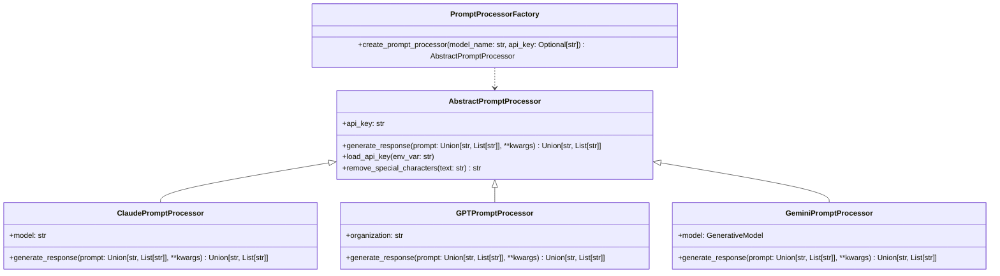

# FLUTE
FLUTE: Flexible Language Unified Tuning Elixir. Provides a factory and an abstract object for LLMs, and possibly BCIs in the future.

## Installation

You can install FLUTE using pip:
```
pip install FLUTE-LLM
```

## Usage

### Creating a Prompt Processor

To create a prompt processor, use the `PromptProcessorFactory` class and call the `create_prompt_processor` method with the desired model name and API key:

```python
import flute
from flute.Modules.PromptProcessorFactory import PromptProcessorFactory

model_name = "claude-3-haiku-20240307"
api_key = "your_api_key"

prompt_processor = PromptProcessorFactory.create_prompt_processor(model_name, api_key)
```

For Claude, GPT, and Gemini, you may simply write:
```python
import flute
from flute.Modules.PromptProcessorFactory import PromptProcessorFactory

model_name = "claude-3-haiku-20240307"

prompt_processor = PromptProcessorFactory.create_prompt_processor(model_name)
```

The `create_prompt_processor` method will return an instance of the appropriate prompt processor class based on the provided model name.

### Generating a Response

To generate a response using the prompt processor, call the `generate_response` method with the desired parameters:

```python
prompt = "What is the capital of France?"
response = prompt_processor.generate_response(prompt, max_tokens=100, temperature=0.8)
print(response)
```

The `generate_response` method takes various parameters to control the generation process, such as `max_tokens`, `temperature`, `top_p`, `system`, etc. Refer to the specific prompt processor class documentation for more details on the available parameters.

### Class Diagram



The class diagram shows the inheritance relationship between the abstract base class `AbstractPromptProcessor` and its concrete implementations `ClaudePromptProcessor`, `GPTPromptProcessor`, and `GeminiPromptProcessor`. The `PromptProcessorFactory` class is responsible for creating instances of the appropriate prompt processor based on the provided model name.

### Supported models
Those listed in [PromptProcessorFactory.py](/flute/Modules/PromptProcessorFactory.py) are currently supported.

In brief, they consist of:
- GPT-4 models (GPT-4, GPT-4-turbo, GPT-4o, and most of their different versions)
- Claude 3 and 3.5 models (Haiku, Sonnet, and Opus)
- Gemini models(1.0 Pro, 1.5 Flash, and 1.5 Pro)

# LICENSE
The repository is licensed under the latest version of Modular and Inclusive Software Advancement License Classic (MISA-CLASSIC License).

There are 4 main policies that consist of this license.
1. Disclaimer of Liability
2. Naming Continuity Obligation
3. Waiver of Other Copyrights
4. Modular Extensibility (Defines how to modify the license)

See [the license document](https://github.com/ThePioneerJP/MISA-license-framework/blob/main/MISA-CLASSIC.md) for more details.